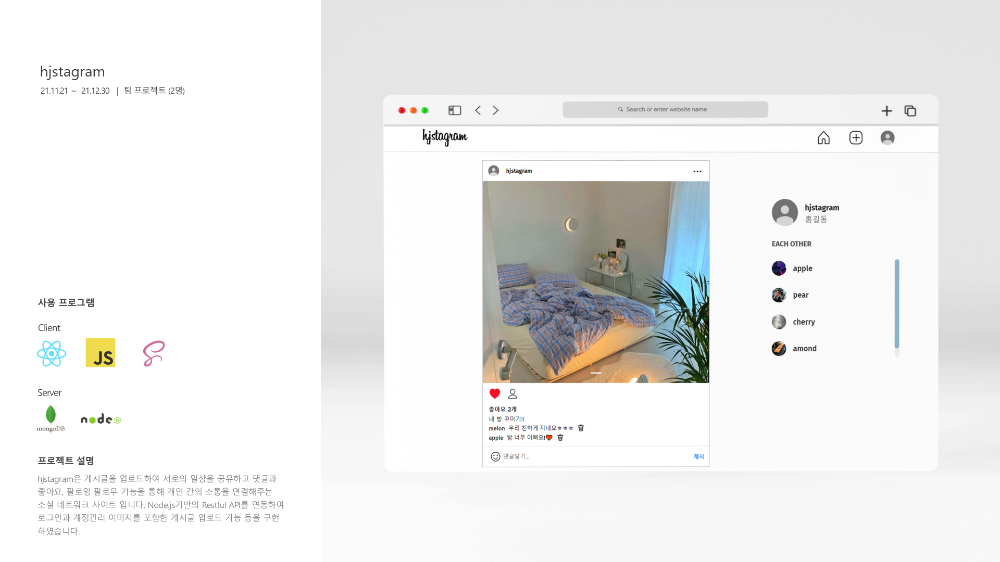
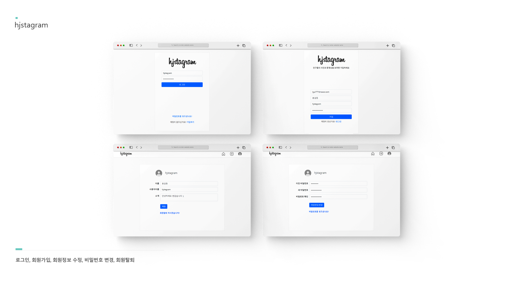
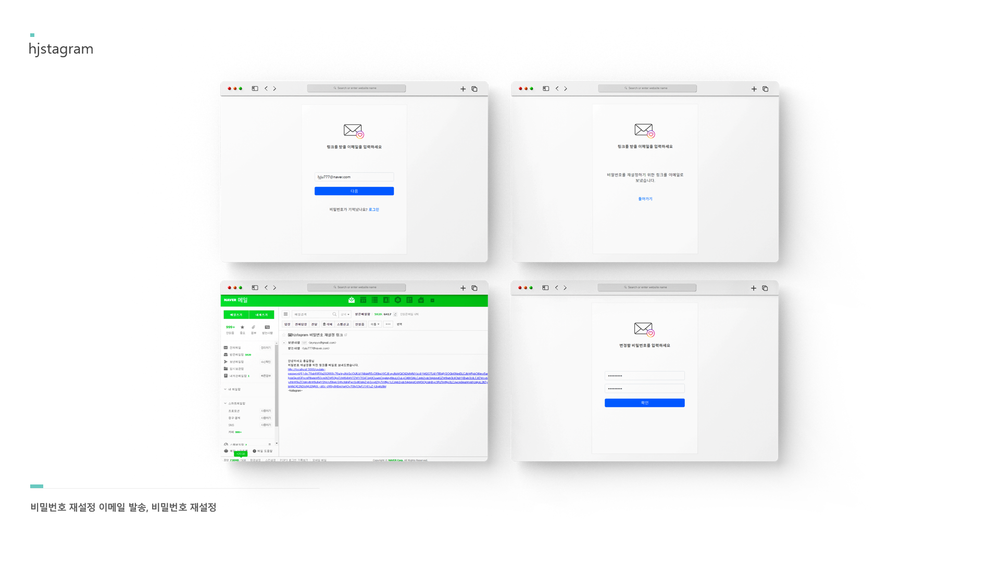
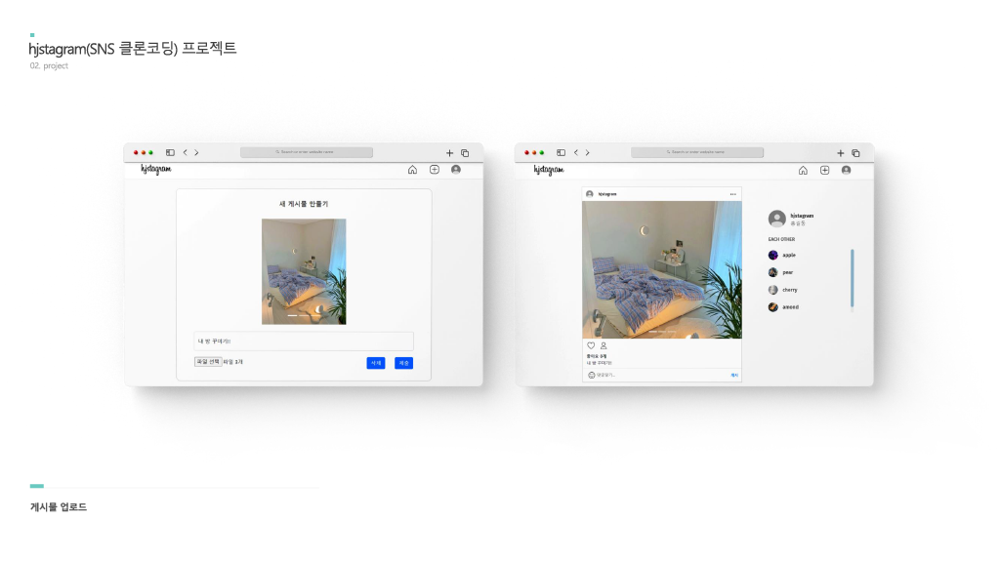
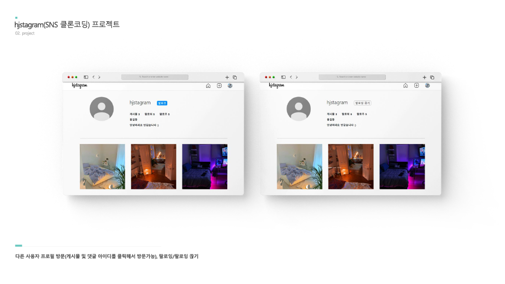
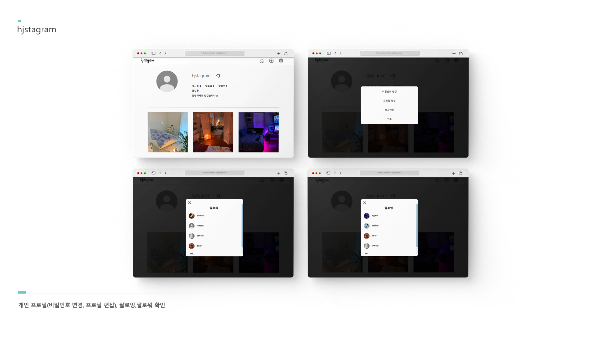
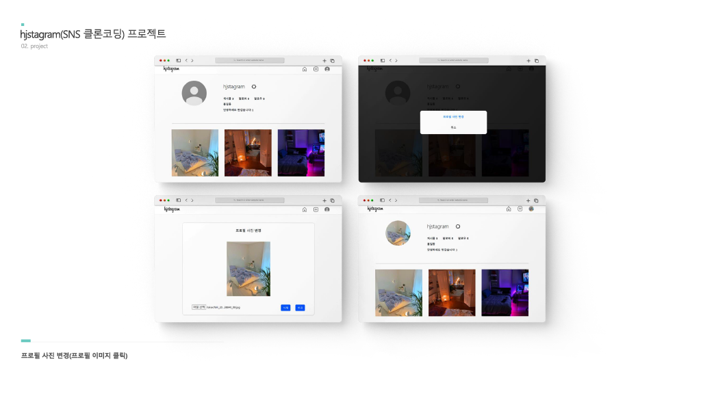
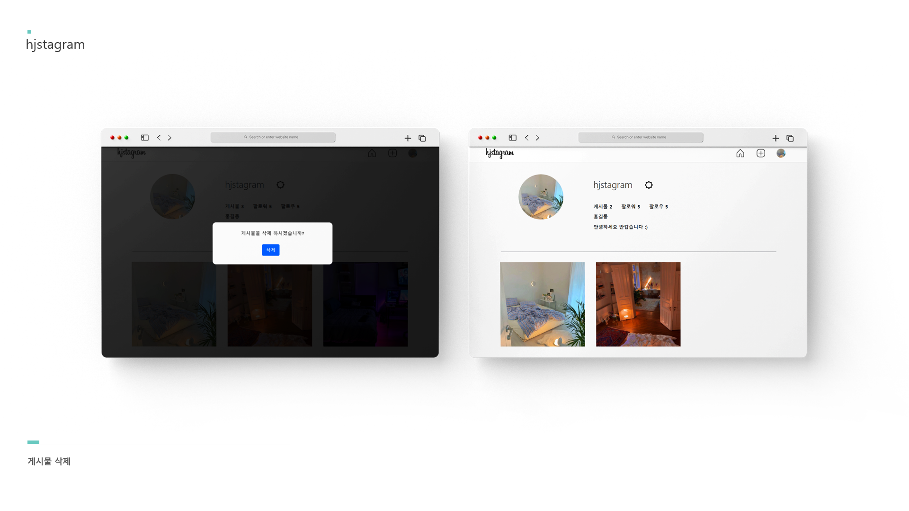

# hjstagram

### 🔗사이트로 이동
➡️ https://web-hjstagram-13d1yv2clqvx92fu.sel5.cloudtype.app/

<br>

### 🛠 구현기술 요약
✅ React17 Router ver6 기반 컴포넌트 UI 구축 및 데이터 상태관리

✅ AWS S3 bucket과 CloudFront를 통한 이미지 파일 업로드 기능구현
  
✅ 데이터 통신을 위한 Axios 연동과 Node.js Express기반 RESTful API 서버 구축
  
✅ JWT를 사용한 사용자 인증 및 권한 부여를 처리 및 bcrypt를 통한 비밀번호 암호화 적용

<br>

## 🪄 Install

### Backend

```sh
cd backend
npm install
```

```sh
npm start
```

### Environment variables

```sh
#default
URL
DB_URL

#Google Gmail
GMAIL_USER
GMAIL_PASS

#AWS S3 Bucket
AWS_ACCESS_KEY_ID
AWS_SECRET_ACCESS_KEY
AWS_REGION
S3_BUCKET_NAME
CLOUD_FRONT_URL
```

<br>

### Frontend

```sh
cd frontend
npm install
```

```sh
npm start
```

### Environment variables

```sh
#default
REACT_APP_API
```

### Requirements
```sh
node v16.15.0

npm install react-scripts --save
npm install -g node-gyp
```

<br>










